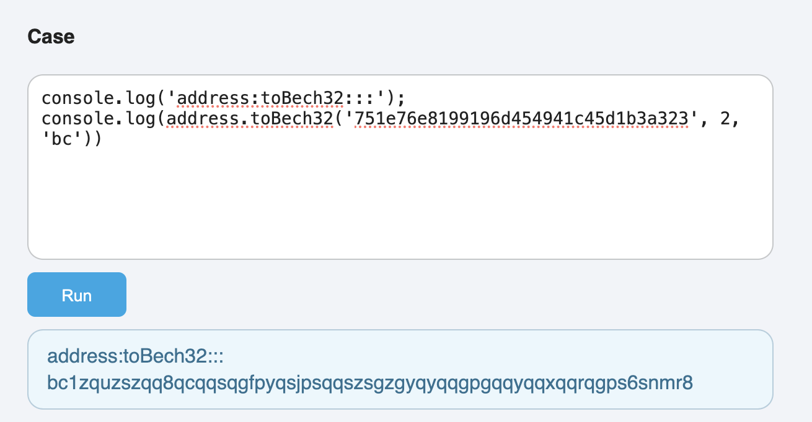

## Typedoc BitcoinJS RunCase Plugin

This is a Typedoc plugin that allows you to load BitcoinJS in a web page and run code online.

### Usage

1. Install the plugin:

```bash
npm install typedoc-plugin-bitcoinjs-runcase --save-dev
```

2. Add the plugin to your Typedoc configuration:

```json
{
  "plugins": ["typedoc-plugin-bitcoinjs-runcase"]
}
```

3. In your code comments, use @case tag to mark code blocks that should be runnable:

```typescript
/**
 * This is an example of using BitcoinJS.
 *
 * @case
 * ```typescript
 * console.log('address:toBech32:::');
 * console.log(address.toBech32('751e76e8199196d454941c45d1b3a323', 2, 'bc'))
 * ```
 */
```

4. Plugin build result



5. You can edit your case and run it!

